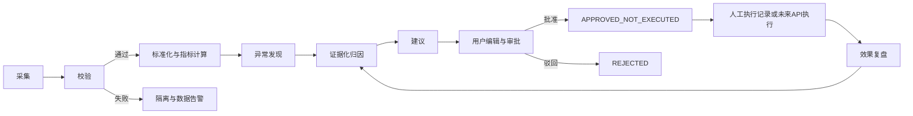

# Amazon AI 原生运营与选品操作系统 PRD

- 文档版本：`0.2`
- 状态：`待确认`
- 目标站点：Amazon US
- 目标规模：单店铺，20 个以内 ASIN
- 数据状态：首版全部使用合成数据；真实 API 未接入

## 1. 产品定义

Amazon AI 原生运营与选品操作系统不是“Dashboard 加 AI 聊天”，而是以 GPT 为总控制层、交互层、分析层和任务调度层的经营工作系统。用户默认面对 Jarvis Supervisor；数据库、API、MCP、计算程序、图表、报表和审批流是它受权限约束调用的工具。专业数据页面继续提供表格、图表、筛选、钻取和导出，但不再是产品的默认入口。

系统每天回答两个问题：

1. 今天为什么出单或没出单？
2. 现在最应该做什么，预期影响是什么，风险是什么？

首页是由业务状态驱动的 AI 动态工作空间，而不是固定 KPI 面板或空白聊天页。系统将每一个结论连接到数据证据、指标口径、建议、审批草案和后续复盘。AI 负责理解意图、编排工具、综合专业 Agent 结论和决定页面组合；精确计算仍由 SQL 或版本化程序完成。AI 不能以自由文本替代计算，也不能把相关性描述为已证实的因果关系。

### 1.1 产品原则

1. AI 是第一入口，并可在没有用户提问时主动发现问题和机会。
2. 首页内容、顺序和组件类型由当次经营证据决定，但只能使用注册组件。
3. 每个 ASIN、广告、关键词、候选产品、图表和数据行都可携带上下文直接“问 AI”。
4. 所有结论、页面模块和建议必须可追溯到来源、时间范围、工具输出与原始记录。
5. AI 推断、第三方估算和第一方事实必须在存储、API 与 UI 三层明确区分。
6. 所有外部写操作必须审批；MVP 更严格，不部署任何 Amazon 写执行能力。

## 2. 产品目标与非目标

### 2.1 MVP 目标

- 由 Jarvis Supervisor 根据实时上下文和主动分析结果生成可审计的 `HomeComposition`，给出当日经营解释、优先行动及证据。
- 建立 12 个专业 Agent 的统一契约、权限和运行日志；MVP 可按场景逐步实现，但验收场景涉及的 Agent 必须真实通过工具工作，不能返回硬编码文案。
- 支持对话式提问与页面内“问 AI”，自动携带对象、筛选、时间范围、来源和指标版本。
- 支持新品冷启动、稳定放量、利润收割、排名恢复四种阶段策略。
- 每天完成一次全量主动分析，每小时检查一次重大异常，并支持已注册业务事件触发定向分析。
- 对销售、流量、广告、关键词、排名、价格、库存、利润和评价建立统一数据模型。
- 对竞品、候选产品、市场新闻、Amazon 政策及政策影响建立可追溯模型。
- 所有指标可由 SQL 或程序重算，并显示数据新鲜度、来源类型、归因口径和置信度。
- 生成广告、Listing、价格调整的建议与审批草案，但不调用写 API。
- 建立业务长期记忆，区分永久事实、用户偏好、临时假设、AI 推断和过期信息；记忆不能替代当前数据查询。
- 用高覆盖、时间连续、业务一致的合成数据演示完整闭环。

### 2.2 MVP 非目标

- 自动修改广告、Listing、价格或库存。
- 保存买家姓名、地址、电话、邮箱等非必要 PII。
- 实现财务会计总账或报税系统。
- 在 MVP 中承诺 Amazon Marketing Stream、AMC 或全部 Brand Analytics 能力已接入。
- 支持多店铺代运营、客户计费或复杂组织结构 UI。
- 用 LLM 直接生成不可复算的经营数值。
- 把第三方销量估算、搜索量估算或 AI 推断当作 Amazon 官方真实值。
- 让模型直接访问数据库、执行任意 SQL、访问任意 URL或一次性获得全部工具。
- 部署或注册 `execute_approved_action`；该名称仅作为未来版本的受控契约保留。

## 3. 用户与核心任务

### 3.1 主要用户

首版只有店铺经营者一名实际用户，同时承担 Owner、Operator 和 Approver。数据库仍保留 `tenant_id`、用户、角色和权限边界，以便后续增加运营、广告专员和审计角色。

### 3.2 每日核心任务

1. 打开首页，由 AI 自动呈现当前最重要的经营状态、机会、风险和数据新鲜度。
2. 通过对话或动态模块查看“出单/未出单解释”及证据链。
3. 按 AI 排序处理行动，或从任一页面对象直接发起带上下文的追问。
4. 修改建议参数，形成实验、广告、Listing、价格、补货或选品项目草案。
5. 批准、驳回或搁置草案；MVP 批准后状态为 `APPROVED_NOT_EXECUTED`。
6. 在实验与复盘中心检查历史建议是否产生预期影响，并将确认/拒绝反馈写入可审计业务记忆。

## 4. 经营阶段策略

阶段影响排序、首页目标、容忍区间和建议类型，不改变指标事实。系统每日计算 `recommended_stage`，但不得未经用户确认改变 `effective_stage` 或由此直接改变实际运营策略。

每条阶段记录同时保存：`recommended_stage`、`effective_stage`、`stage_confidence`、`stage_reasons`、`manual_override`、`override_reason`、`effective_from` 和 `effective_to`。系统根据上架天数、近 7/14/30 天销量、自然排名、广告销售占比、TACOS、贡献利润、流量与转化趋势、库存状态生成建议阶段。建议变化必须提醒用户；用户可确认、修改或锁定实际阶段，人工覆盖需记录原因并保留历史。

| 阶段 | 首要目标 | 次要目标 | 可容忍行为 | 典型风险 | 建议排序 |
|---|---|---|---|---|---|
| 新品冷启动 | 订单、目标词可见度与排名爬升 | 有效点击与评价基础 | 在配置上限内短期高 ACOS | 无效流量、索引缺失、预算过早耗尽 | 收录/转化阻断 > 核心词流量 > 出价预算 > 利润 |
| 稳定放量 | 订单和有效规模增长 | TACOS 稳定、库存安全 | 短期扩词探索 | 预算限制、边际流量变差、断货 | 库存 > 高效增量 > 流量缺口 > 成本 |
| 利润收割 | 贡献利润和现金效率 | 稳定自然单与份额 | 放弃低质量增量 | 排名回落、流量过度收缩 | 利润泄漏 > 低效广告 > 价格 > 排名防守 |
| 排名恢复 | 目标词自然排名和订单恢复 | CVR、流量结构恢复 | 阶段性高 ACOS | 错误归因、库存不足、促销依赖 | 可售/索引 > 转化异常 > 核心词防守 > 扩量 |

阶段策略中的 ACOS 上限、目标排名、预算增幅、最低库存覆盖天数均为用户配置，不写死成“行业标准”。合成数据中的策略阈值必须标记为 `synthetic policy fixture`。

首页不存在跨阶段唯一默认目标。Jarvis 根据店铺内 ASIN 的 `effective_stage`、阶段组合和风险严重度选择首屏内容：新品冷启动优先订单、核心词曝光/点击/转化与排名，利润只作止损约束；稳定放量优先销量增长、边际 ACOS、TACOS 与库存安全；利润收割优先广告后贡献利润、现金效率与自然订单占比；排名恢复优先目标词排名、订单、CVR 与流量结构恢复。

## 5. 核心闭环与状态机

### 5.1 建议状态

`DRAFT -> READY_FOR_REVIEW -> APPROVED_NOT_EXECUTED | REJECTED | SNOOZED | EXPIRED`

未来启用写 API 后才增加：

`APPROVED_NOT_EXECUTED -> EXECUTION_QUEUED -> EXECUTED -> VERIFIED | ROLLED_BACK | EXECUTION_FAILED`

### 5.2 结论证据要求

每条异常、归因或建议必须包含：

- 观察对象和时间范围。
- 当前值、基线值、偏差及所用指标版本。
- 实际来源类型与数值语义分开：`source_kind` 标识 `SYNTHETIC`、`LIVE_API`、`USER_UPLOAD` 或 `PUBLIC_WEB`；`semantic_source_kind` 标识 `FIRST_PARTY`、`THIRD_PARTY_ESTIMATE`、`PUBLIC_OBSERVATION`、`AI_INFERENCE` 或 `USER_PROVIDED`。
- 数据新鲜度、完整度、归因窗口与置信度。
- 支持证据、反证或替代假设。
- 建议动作、预期影响范围、下行风险和复盘窗口。
- 可点击回到原始/标准化数据与计算 SQL 的 lineage。

“价格下降后销量上升”只能写为关联观察，除非存在合格实验或明确因果识别设计。

## 6. 功能需求

### 6.1 AI 动态运营首页

首页采用 GPT 式交互结构、专业数据工作台和克制的智能氛围，是同一设计系统下的动态工作空间，不是固定 BI 大屏。稳定骨架包括三栏桌面布局、AI 问候与输入、动态内容画布、上下文/审批面板；画布内容与优先级由 `HomeComposition` 决定。

首屏必须回答：当前店铺/站点/业务日期是什么、数据是否可用、今天为什么出单或没出单、现在最应该做什么。至少包含：

- AI 欢迎与一句话经营结论。
- 大型输入框与快捷问题。
- 今日前三项行动、重大问题、最佳经营信号和待审批事项。
- 数据更新时间、来源摘要、置信度和可展开分析过程。

Supervisor 只能从注册组件中选择：`executive_summary`、`priority_action`、`critical_alert`、`positive_signal`、`metric_card`、`line_chart`、`comparison_chart`、`data_table`、`order_funnel`、`ad_diagnosis`、`keyword_opportunity`、`competitor_change`、`inventory_risk`、`profit_simulation`、`product_opportunity`、`policy_alert`、`news_impact`、`experiment_result`、`approval_request`、`follow_up_question`。每个块必须包含展示理由、证据引用、数据更新时间、置信度和审批需求。

首页必须支持四种同系统、不同排序的完整状态：

| 状态 | 首要内容 | 次要内容 |
|---|---|---|
| 正常经营日 | 增长机会、正向信号 | 选品机会、进行中的实验 |
| 订单或广告异常 | 重大问题、订单漏斗、广告/搜索词诊断 | 今日三项行动 |
| 库存或利润风险 | 断货时间、补货方案、现金与利润影响 | 采购审批草案 |
| 市场或政策变化 | 政策原文、受影响 ASIN、风险与期限 | 应对行动、市场/选品机会 |

首页交互：

- 切换店铺、业务日、经营阶段和比较基线；这些值同步进入 AI 上下文。
- 默认以 `America/Los_Angeles` 计算美国站业务日期；数据库保存 UTC 和来源原始时区，前端可切换到中国运营人员本地时间显示，但不能改变业务日归属。
- 展开每条原因的证据，查看公式、口径、Agent/工具运行和原始来源。
- 从建议直接创建审批草案或标记“不相关/已处理/延后”。
- 当天数据未成熟时，明确显示 `PROVISIONAL`，不下确定性结论。
- `HomeComposition` 校验失败、证据失效或数据源不健康时回退到安全状态，而不是渲染模型自由生成 UI。

### 6.2 ASIN 驾驶舱

- 展示 ASIN 生命周期、目标、价格、库存、销售、流量、广告、自然排名、利润和 Listing 状态。
- 支持事件叠加：价格变化、Coupon、Listing 修改、广告调整、断货、入库、阶段切换。
- 自动生成 ASIN 级原因树和建议，允许横向比较同父体变体。
- 每个数值可查看来源、粒度、时区、币种、归因和计算版本。

### 6.3 广告与搜索词中心

- Campaign、Ad Group、Target、Search Term 四级下钻。
- 支持 Sponsored Products 为 MVP 主路径；其他广告产品保留模型但不要求全量实现。
- 区分流量日指标与转化成熟度，显示归因窗口结束前的 `PROVISIONAL` 状态。
- 识别预算耗尽、无曝光、高点击低转化、搜索词浪费、好词漏投、关键词互抢等问题。
- 创建否定词、出价、预算、匹配方式调整草案；不执行。

### 6.4 关键词与自然排名中心

- 维护关键词池、标签、优先级、目标排名、关联 ASIN。
- 同屏展示自然排名、广告排名、搜索量估算、点击份额、购买份额和广告搜索词表现。
- 排名快照必须记录设备、地区、邮编/定位策略、抓取页数和来源，避免把不同采集条件串成趋势。
- 支持排名掉失、已收录但不可见、自然/广告错配和核心词机会检测。

### 6.5 竞品市场中心

- 管理竞争 ASIN 集合，不自动把相似商品当成直接竞品。
- 展示价格、优惠、评分、评论数、BSR/类目排名、卖家、上架时间及第三方销量估算。
- 任何第三方销量和销售额必须显示“估算”，不得与自有店铺官方销售额直接合计。
- TikTok/YouTube 数据仅用于创意与需求信号，不作为 Amazon 订单归因。

### 6.6 Listing 与评价分析

- 保存 Listing 版本快照和差异：标题、五点、描述/A+、图片、类目属性和问题。
- 将 Customer Feedback、评价主题和退货主题聚合为产品问题，不保存非必要买家 PII。
- AI 输出主题、证据片段、频次、趋势、置信度及建议文案草案。
- Listing 草案必须展示修改前后差异、声明风险和待验证假设。

### 6.7 库存利润采购中心

- 展示可售、预留、入库、不可售库存，预测库存天数和断货日期。
- 维护成本版本：采购成本、头程、关税、包装、平台费用、仓储、促销、退款和广告。
- 用户上传合同、采购单、转账凭证、物流单据后，原文件只追加保存，提取字段需人工确认。
- 成本不完整时不输出确定性利润，显示利润区间和缺失项。

### 6.8 实验、审批与操作日志中心

- 建议可转成实验或一次性操作草案。
- 草案包含对象、当前值、目标值、预期、风险、回滚方法、观察窗口和冲突检查。
- 所有状态变化追加审计事件，保留操作者、时间、前后快照和原因。
- 支持人工记录“已在 Seller Central 执行”，但必须与 API 执行区分。
- 复盘比较执行前基线、执行后窗口、同期异常和是否达到成功标准。

### 6.9 选品机会与候选产品中心

- 融合类目需求、竞争强度、价格带、评论痛点、成本、供应链、合规和趋势信号，生成可解释的候选机会；不同来源不做无口径说明的直接合计。
- 候选产品保存假设、证据、估算模型、关键风险、淘汰原因和研究进度。
- `find_product_opportunities` 负责召回候选，`evaluate_product_candidate` 使用版本化规则与模拟程序评分；LLM 负责综合和提出待验证问题，不凭空生成销量或利润。
- 候选产品可创建调研任务、实验或采购计划草案，MVP 不提交采购、不向供应商发送信息。

### 6.10 新闻与政策中心

- 每日检查 Amazon 官方公告、Seller Central News、Amazon Ads、SP-API/Ads API、类目、Listing、评价、FBA 费用、库存、Coupon/促销和相关美国合规政策。
- 官方来源优先；第三方解读仅作补充，政策卡必须显示原始链接、发布日期、生效日期和采集时间。
- 不止摘要：必须判断影响对象、受影响 ASIN、机会/风险、影响等级、处理期限、建议动作和审批需求。
- 不能确认适用性时输出限制与待核实项，禁止将新闻推断写成已生效政策事实。

### 6.11 全页面 AI 上下文

每个专业页面提供“问 AI”“解释这个数字”“为什么变化”“与上周期/竞品相比”“生成实验”“加入今日任务”和“申请执行草案”。发起时自动传递当前实体引用、筛选条件、时间范围、站点、数据来源、指标版本和 UI 定位；服务端重新授权并校验引用，不能信任前端提供的 tenant 或权限。

## 7. 诊断与建议排序

### 7.1 原因树

系统按以下顺序排查“没出单/低于预期”：

1. 数据是否完整且成熟。
2. ASIN 是否可售、是否有库存、Listing 是否被抑制。
3. 流量是否下降：自然、广告、外部流量分别检查。
4. 转化是否下降：价格、优惠、评价、Listing、流量结构分别检查。
5. 广告是否受预算、竞价、投放状态或搜索词质量限制。
6. 核心关键词自然排名和广告可见度是否下降。
7. 是否存在促销、节假日、竞品价格或类目需求变化。

### 7.2 建议优先级分数

排序分数是可解释的规则结果，不由 LLM 随意给分：

`priority_score = impact * urgency * confidence * reversibility * stage_weight - risk_penalty`

各因子为版本化配置；界面显示分项，不把分数伪装成确定收益。LLM 负责总结、补充风险和生成结构化草案，计算服务负责数值。

## 8. 时间与刷新

- 持久化时间统一使用 UTC，来源时区原样记录。
- 美国站默认业务展示时区为 `America/Los_Angeles`，用户可配置。
- 小时巡检：检查库存归零、Listing 不可售、广告异常放量/停摆、数据源中断等重大异常。
- 每日全量：在配置的结算时间运行数据拉取、重算、诊断、建议生成与日报快照。
- 事件触发：新订单、人工经营修改、新差评、库存变化、政策更新、竞品变化、文件上传和选品状态变化只触发相关领域分析；事件载荷不能替代当前查询。
- 归因未成熟的数据标记 `PROVISIONAL`；归因窗口结束且源数据稳定后标记 `MATURED`。
- 迟到数据触发受影响分区重算，不覆盖原始层。

## 9. 成功指标

产品成功不以“图表数量”衡量，MVP 关注：

- 100% 展示数值可追溯到来源与指标版本。
- 100% 已发布首页块来自版本化组件注册表，并可追溯到 Agent、工具、证据和展示理由。
- 100% 合成记录标记 `synthetic=true`。
- 0 个对 Amazon 的自动写操作。
- 每个日简报在数据足够时至少给出一条有证据的判断；数据不足时生成 `DATA_INCOMPLETE` 组合并明确说明缺口。
- 用户能在 3 次点击内从首页建议到达证据和审批草案。
- 重大异常在小时任务完成后可见，且重复告警被去重。
- 建议的采纳、驳回和效果均可复盘。

## 10. 已确认默认决策

- 美国站业务日期使用 `America/Los_Angeles`；持久化统一 UTC 并保留来源原始时区，前端支持切换中国运营人员本地时间。
- 阶段由系统每日生成 `recommended_stage`，用户确认、修改或锁定 `effective_stage`；系统不得静默改变实际阶段。
- MVP 广告聚焦 Sponsored Products。
- 首页经营目标随阶段动态变化，广告后贡献利润是重要指标但不是所有 ASIN 的唯一默认目标。
- MVP 只读，只生成建议与审批草案；批准后仍为 `APPROVED_NOT_EXECUTED`。
- 所有模拟经营数据 `synthetic=true`；睡眠、枕头和家居用品作为深度案例，同时保留跨类目候选池。
