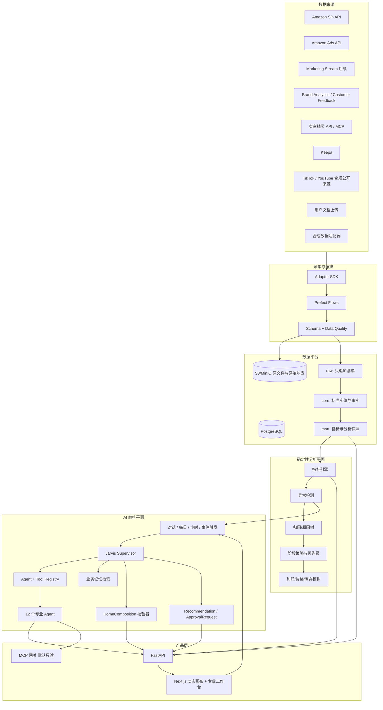

# 系统架构

## 1. 架构原则

- 以 20 个以内 ASIN 的实际规模设计，MVP 使用模块化单体，不提前拆微服务。
- 原始数据不可变，标准数据与指标可重算。
- 规则与 SQL 先产生可复算事实，LLM 只基于工具结果生成解释和结构化建议。
- Jarvis Supervisor 是统一控制平面；专业 Agent 是有独立职责、工具白名单和输出 Schema 的逻辑角色，不在 MVP 中拆成独立服务。
- 工具按意图、对象、权限和数据可用性动态加载，不将全部工具一次性暴露给模型。
- 所有来源通过统一 provenance envelope 进入系统。
- 读取与写入能力物理分离；MVP 不部署 Amazon 写适配器。
- 数据质量失败优先阻断结论，而不是让 AI 猜测缺失值。
- UI 只渲染版本化组件注册表中的 HomeComposition，模型不能生成任意前端代码。

## 2. 逻辑架构

## 3. 技术组件

| 层 | MVP 选择 | 职责 |
|---|---|---|
| Web | Next.js、TypeScript、ECharts | GPT 式工作空间、HomeComposition 渲染、工作台、下钻、草案与复盘 |
| API | Python FastAPI、Pydantic | 领域 API、认证授权、查询、审批状态机 |
| Worker | Python worker | 指标、检测、文档提取、Agent 运行与异步分析 |
| 调度 | Prefect | 小时巡检、每日全量、事件任务、回填、重算、重试 |
| 数据库 | PostgreSQL | 维表、事实、指标、建议、审批、审计 |
| 对象存储 | S3 兼容；本地 MinIO | 原始 API 响应、报表、上传文件、导出物 |
| AI | OpenAI Responses API 或等价结构化工具调用入口 | Supervisor 编排、专业 Agent、结构化页面/建议；禁止直接算核心指标 |
| AI 工具网关 | Function Calling、只读 MCP、Web Search、File Search | 工具注册、动态选择、参数校验、权限、配额、审计和来源封装 |
| 缓存 | MVP 可不引入；需要时 Redis | 短期任务状态、去重锁和热点缓存 |
| 可观测性 | OpenTelemetry + 结构化日志 | trace、任务、适配器、LLM 调用审计 |

## 4. 模块边界

FastAPI 保持一个部署单元，但代码按领域隔离：

| 模块 | 所有权 |
|---|---|
| `identity` | tenant、用户、角色、会话 |
| `catalog` | ASIN、SKU、Listing、生命周期 |
| `retail` | 销售、流量、价格、订单聚合 |
| `advertising` | Campaign、Ad Group、Target、Search Term、广告事实 |
| `search` | 关键词、排名、Search Query Performance |
| `market` | 竞品、Keepa、卖家精灵、外部趋势 |
| `selection` | 细分市场、机会、候选项目、程序化评分、研究任务与淘汰证据 |
| `sourcing` | 供应商、报价、样品、合同、采购单与付款 |
| `logistics` | 运输、到货批次、头程/关税/包装分摊与落地成本 |
| `inventory` | 库存、入库、销量速度、断货预测 |
| `finance` | 成本版本、费用、贡献利润、采购文件 |
| `insights` | 数据质量、异常、原因、建议、阶段策略 |
| `orchestration` | Supervisor、Agent registry、tool registry、运行状态与结构化输出校验 |
| `workspace` | 对话、上下文快照、HomeComposition、动态块与页面问 AI |
| `memory` | 业务事实、偏好、假设、AI 推断、有效期、确认与失效 |
| `policy_news` | 官方政策、新闻、变更检测、影响分析和受影响对象 |
| `approvals` | 草案、审批、冲突检查、状态机 |
| `experiments` | 基线、观察窗口、复盘 |
| `connectors` | 适配器、采集运行、原始对象和 lineage |

模块间通过应用服务和稳定 DTO 交互，禁止跨模块随意写表。

## 5. 数据分层

### 5.1 Raw / Bronze

- API 原始 JSON、CSV、报表压缩包和上传文档保存在对象存储。
- PostgreSQL 只保存不可变清单、校验和、请求参数、响应头、来源版本和对象 URI。
- 相同内容按 SHA-256 去重，但每次采集运行仍保留事件记录。
- 不在原始层修正币种、时区或字段名称。

### 5.2 Core / Silver

- 标准化实体 ID、时间、币种、枚举和字段类型。
- 保留来源值与规范值映射；无法映射的记录进入 quarantine。
- 广告、零售、第三方估算分表或分 `measure_basis` 保存。
- 允许幂等重建，不回写 raw。

### 5.3 Mart / Gold

- 版本化指标、基线、成熟度、异常、原因树和每日简报快照。
- 聚合表按 `tenant_id + marketplace + date/hour + entity` 分区或索引。
- 所有指标记录 `metric_definition_version` 和输入 lineage。

## 6. 采集与计算流程

### 6.1 小时巡检

1. 读取适配器能力与连接状态。
2. 拉取可用的小时级/快照级数据；合成模式推进逻辑时钟。
3. 执行 schema、重复、范围、连续性和新鲜度检查。
4. 更新库存、可售、广告流量和数据健康的小时 mart。
5. 运行重大异常规则并去重。
6. 只在异常新发、升级或恢复时创建事件。

### 6.2 每日全量

1. 拉取前一业务日及回补窗口数据。
2. 校验与标准化受影响分区。
3. 重算核心指标与阶段化基线；按上架天数、7/14/30 天销量、排名、广告销售占比、TACOS、贡献利润、流量/CVR 趋势和库存生成阶段建议。
4. 标记广告转化数据 `PROVISIONAL` 或 `MATURED`。
5. 运行异常、原因树、建议排序，并检索新闻、政策、竞品和选品变化。
6. 触发 Jarvis Supervisor，按业务状态选择专业 Agent 和最小工具集。
7. 专业 Agent 通过只读/模拟工具获取已计算证据，输出各自 JSON Schema。
8. Supervisor 综合结果并输出 HomeComposition、建议与待审批草案。
9. 校验所有 AI 输出 Schema、组件类型、引用 ID、数据新鲜度和权限。
10. 固化首页组合、工具链路和运营晨报快照并通知前端。

### 6.3 事件驱动分析

事件总线在新订单、广告/Listing/价格人工变更、新差评、库存变化、政策更新、竞品显著变化、文件上传和选品项目状态变化时创建去重任务。事件只触发相关领域 Agent，不默认运行全店分析。事件载荷只含稳定实体引用；Agent 必须通过工具重新读取当前值，不能把事件消息当成最新事实。

### 6.4 主动分析发布规则

- 每日深度分析始终产生版本化运行记录；数据不全时首页状态为 `DATA_INCOMPLETE`。
- 小时异常只在新发、升级或恢复时通知，避免重复打扰。
- 事件分析可更新行动队列，但不得静默覆盖已发布的历史 HomeComposition。
- 新数据或指标修订会使依赖的洞察、组合块和审批草案标记 `STALE`，由新运行重新生成。

## 7. 指标与归因隔离

每个事实或指标都携带：

`source`、`source_kind`、`semantic_source_kind`、`collected_at`、`marketplace`、`timezone`、`currency`、`grain`、`attribution_window`、`is_estimated`、`confidence`、`synthetic`。

`source_kind` 表示实际来源，合成记录为 `SYNTHETIC`；`semantic_source_kind` 表示数值语义，例如合成 Ads 报表为 `FIRST_PARTY`、合成卖家精灵销量为 `THIRD_PARTY_ESTIMATE`。这样既不会把合成数据误叫真实 first-party，也不会丢失估算/推断语义。

另外记录 `date_basis`：

- `ORDER_DATE`：零售销售和订单。
- `TRAFFIC_DATE`：曝光、点击、花费及通常的广告报表归因结果。
- `SNAPSHOT_TIME`：库存、价格、排名。
- `DOCUMENT_DATE`：合同、采购、转账和物流文件。

数据库时间统一保存 UTC，同时保存来源原始时区。美国站业务日期固定按 `America/Los_Angeles` 归属；前端可切换显示 `Asia/Shanghai` 或浏览器本地时间，但显示切换不能重算业务日。MVP 广告实现范围为 Sponsored Products，其他广告实体只保留扩展模型。

当两个指标的 `attribution_window`、`date_basis`、币种或粒度不兼容时，指标服务拒绝直接比较，并返回可解释错误码。允许的派生混合指标（例如运营 TACOS）必须在定义中明确标注其混合口径。

## 8. AI 编排架构

详细契约见 `docs/11-ai-orchestration.md`。编排层由 Jarvis Supervisor、12 个专业 Agent、Agent/Tool Registry、上下文构建器、业务记忆检索、结构化输出校验器和运行审计组成。专业 Agent 是逻辑职责边界，可以共享模型和 worker；隔离的是提示版本、工具白名单、输出 Schema、超时与预算。

### 8.1 Supervisor 流程

1. 认证请求，构建 tenant、店铺、站点、实体、时间范围、筛选器和来源上下文。
2. 判断触发类型与用户意图，读取最新数据健康、异常和相关有效记忆。
3. 从 Registry 选择最小 Agent 集与工具集；拒绝未授权、未连接或数据不新鲜的工具。
4. 并行或串行运行专业 Agent，并要求每个结论返回 evidence reference 与 limitations。
5. 运行冲突解析、来源优先级、口径兼容和数据新鲜度检查。
6. 生成 HomeComposition、Recommendation 或 ApprovalRequest 等结构化输出。
7. 服务端校验组件、引用、权限、synthetic 标记和审批边界后发布；失败则进入安全回退。

### 8.2 专业 Agent

| Agent | 主要职责 |
|---|---|
| 店铺经营 | 全店经营判断、订单漏斗、行动排序 |
| 广告与搜索词 | 投放、预算、竞价、搜索词浪费与机会 |
| Listing 与转化 | 内容、可售、价格、页面与转化阻断 |
| 关键词与自然排名 | 收录、自然/广告排名、份额与词机会 |
| 竞品 | 竞品集合、价格、优惠、评价、BSR 与变化 |
| 选品 | 机会召回、候选评估、验证计划和淘汰原因 |
| 库存与补货 | 库存覆盖、断货、入库和补货草案 |
| 财务与利润 | 成本完整度、贡献利润、价格与利润模拟 |
| 评价与用户痛点 | 评价、退货、反馈主题和证据片段 |
| 市场趋势与政策 | 官方政策、新闻、市场趋势与影响对象 |
| 创意与短视频 | 合规公开创意信号、创意方向与实验草案 |
| 风险与合规 | 数据、账号、内容、政策、审批和操作风险 |

### 8.3 工具边界与动态加载

Registry 为工具保存能力、输入/输出 Schema、风险级别、允许的 Agent、所需权限、来源类型、连接状态、配额和超时。Supervisor 先选择任务包，再只把相关工具暴露给该次运行。数据库查询由参数化服务封装，不允许任意 SQL；Web Search 限定政策/新闻域并保存原始链接；File Search 只检索已扫描且授权的租户文件；第三方 MCP 默认只读并完整记录传入、传出摘要。

MVP 可注册查询、比较、异常、解释、模拟、建议和审批草案工具。`execute_approved_action` 仅在文档中保留未来契约：MVP 不实现、不部署、不向模型注册、不提供外部写凭证。即使未来启用，也必须验证已批准且未过期的不可变 action payload、对象当前版本、幂等键和回滚策略。

### 8.4 HomeComposition

HomeComposition 至少包含业务日期、总体判断、总体置信度、判断依据、最重要问题、最佳信号、前三项行动、顶层是否需要审批、数据状态和有序 blocks。Jarvis 以已确认 `effective_stage` 决定目标排序：LAUNCH 偏订单/关键词/排名且利润为止损，SCALE 偏销量/边际 ACOS/TACOS/库存，HARVEST 偏广告后贡献利润/现金效率/自然单，RECOVERY 偏目标词排名/订单/CVR/流量结构。每个 block 只能引用组件注册表中的类型，并携带 priority、display_reason、evidence_refs、data_period、updated_at、confidence、limitations 和 requires_approval。前端通过稳定 DTO 取数，不能执行模型输出的 HTML、JavaScript、SQL 或 URL。

### 8.5 长期记忆

记忆类型分为 `PERMANENT_FACT`、`USER_PREFERENCE`、`TEMPORARY_HYPOTHESIS`、`AI_INFERENCE`；`EXPIRED` 是生命周期状态，不是事实类型。每条记录保存来源、确认者、置信度、有效期、适用范围、替代/撤销关系和最后验证时间。分析前只检索与当前对象和意图相关的有效记忆；事实查询优先于记忆，记忆过期或与当前数据冲突时必须降权并提示复核。

### 8.6 结构化输出与审计

每次 AI 分析保存 conversation/message、AI run、agent run、工具调用与输出、模型、prompt 版本、输入引用、结构化输出、token/成本、延迟、安全检查和 trace ID。模型输出未通过 Schema、引用不存在或越权对象、把不兼容口径直接比较、或数据健康不达标时不发布，并保存机器可诊断失败原因。

## 9. 可靠性设计

- 采集运行使用 `source + account + marketplace + dataset + window` 幂等键。
- 按来源限流、指数退避并尊重 `Retry-After`。
- 报表异步生成采用可恢复状态机，不用长连接等待。
- 对象写入先校验 checksum，再提交数据库清单。
- 单个来源失败不阻断其他来源；依赖该源的指标标记不可用。
- 数据修订触发定向重算和洞察失效，不静默覆盖已发布简报。
- 建议在输入指标变更后标记 `STALE`，不能继续审批。

## 10. 部署拓扑

### 10.1 本地演示

Docker Compose：`web`、`api`、`worker`、`prefect-server`、`postgres`、`minio`。合成数据适配器是唯一启用的数据源；新闻与政策使用可重放的合成/固定抓取夹具，不能伪装成当前实时信息。MVP 镜像和部署清单中不存在 Amazon 写执行服务。

### 10.2 生产建议

- Web 和 API 使用托管容器或等价平台。
- PostgreSQL 使用托管数据库并开启 PITR。
- 对象存储启用版本化、服务端加密和生命周期策略。
- Secrets Manager 注入密钥，应用启动时校验，不写入镜像或日志。
- Worker 与 Web/API 使用不同服务身份和网络权限。

## 11. 架构决策记录

| ADR | 决策 | 理由 |
|---|---|---|
| ADR-001 | MVP 使用模块化单体 | 规模小、跨域事务多、便于快速验证；保留清晰模块边界 |
| ADR-002 | PostgreSQL 同时承载业务库与分析 mart | 当前数据量可控，减少基础设施复杂度 |
| ADR-003 | 原文件存对象存储，数据库存清单 | 支持只追加、低成本保留和可重放 |
| ADR-004 | AI 不计算核心指标 | 保证复算、测试和审计 |
| ADR-005 | MVP 不部署写适配器 | 产品要求所有修改需确认，首版进一步收紧为不执行 |
| ADR-006 | 模拟适配器与真实适配器共享契约 | 无密钥时可完整开发，同时防止日后替换破坏领域层 |
| ADR-007 | Supervisor + 逻辑专业 Agent | 统一交互与排序，同时保留领域工具、提示、预算和审计边界 |
| ADR-008 | 动态加载最小工具集 | 降低延迟、成本、误调用和提示注入的权限面 |
| ADR-009 | HomeComposition 只引用组件注册表 | 保持动态首页可控、可测试、可访问且不执行模型代码 |
| ADR-010 | 业务记忆不能替代当前查询 | 避免过期偏好或推断污染经营事实 |
| ADR-011 | `execute_approved_action` 仅保留未来契约 | MVP 从路由、注册表、凭证和部署四层禁用外部写 |
