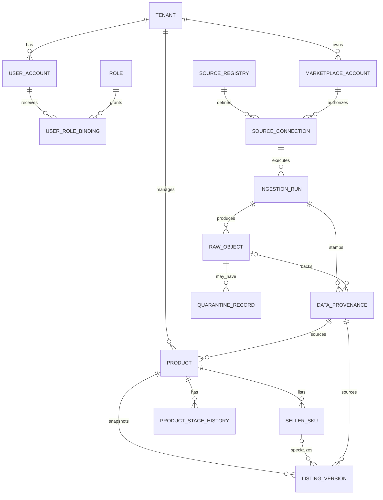
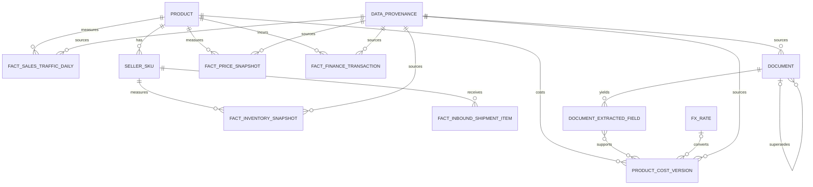
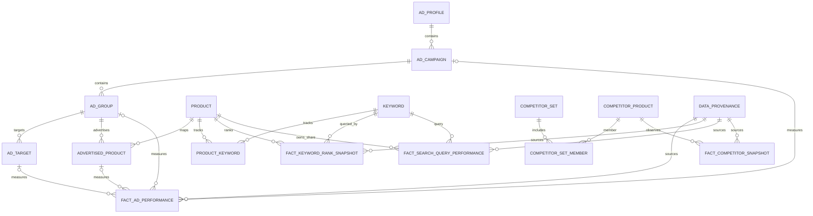
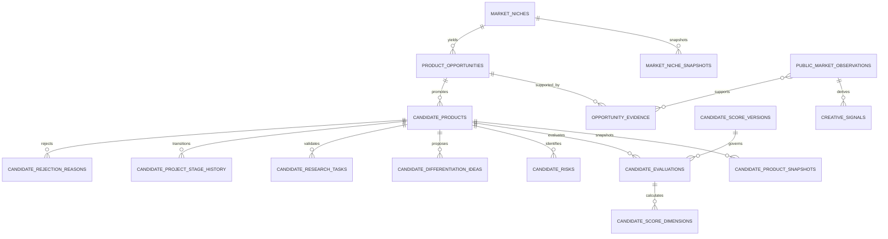
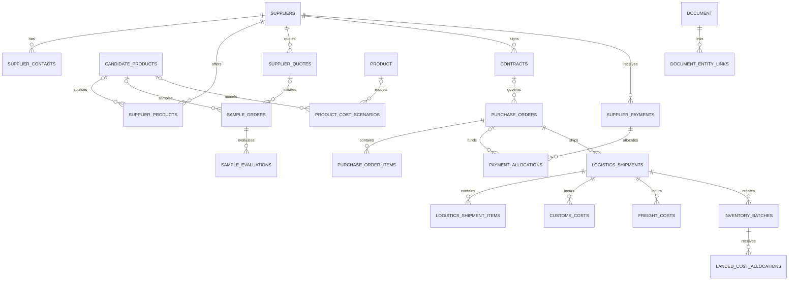
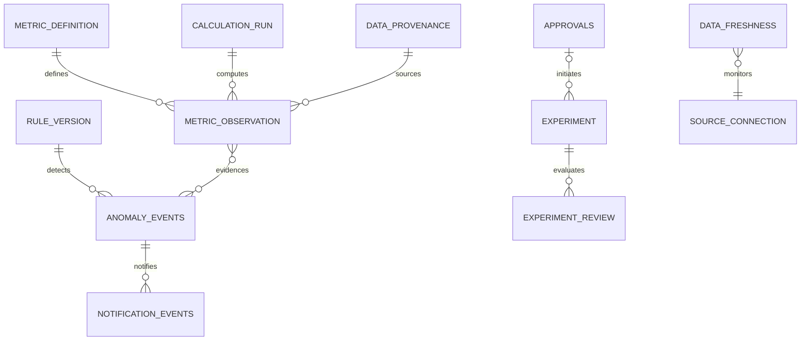
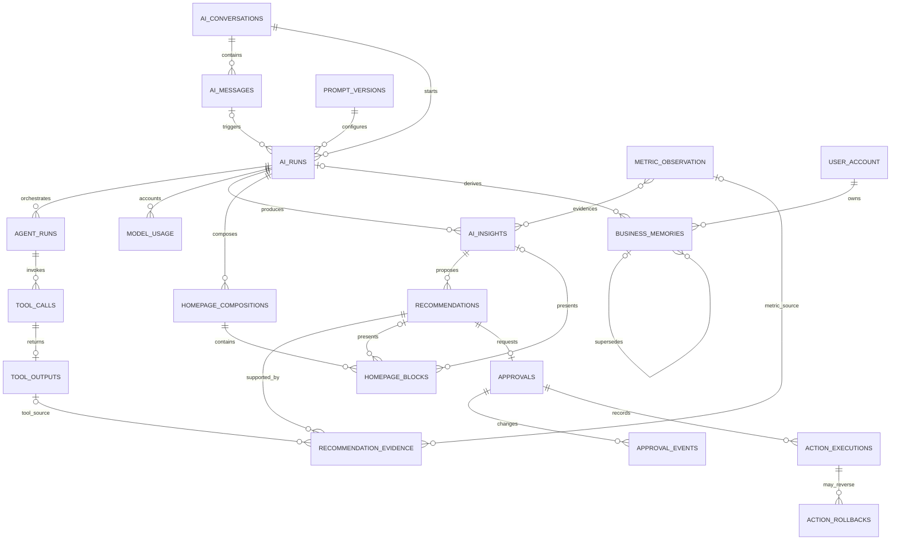
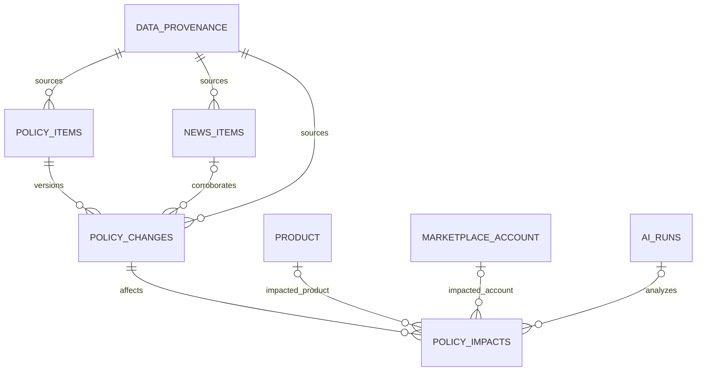

# 数据库 ER 模型

## 1. 设计说明

- PostgreSQL schema：`iam`、`connectors`、`catalog`、`retail`、`ads`、`search`、`market`、`selection`、`sourcing`、`logistics`、`finance`、`insights`、`ai`、`memory`、`policy_news`、`workflow`、`audit`、`mart`。
- raw 对象和 audit event 只追加。
- core 标准化表可重建；修订以运行版本追加，`current_*` 视图选择有效版本。
- 所有业务表含 `tenant_id` 并启用 Row Level Security。
- 所有数据表通过 `provenance_id` 连接不可变来源信封。

## 2. 平台与商品域



## 3. 零售、库存与财务域



## 4. 广告、关键词与市场域



### 4.1 选品机会与候选项目



`candidate_score_versions` 冻结归一化规则、权重、代码引用与 checksum；`candidate_score_dimensions` 保存原始指标、标准化分数、权重、来源、估算标志、置信度、扣分和人工核实项。LLM 只解释程序结果。候选项目每次状态变化追加历史，进入 `REJECTED` 时 rejection reason 和 evidence 为事务内强制条件。

### 4.2 供应商、采购、物流与成本



所有金额保留原币、金额、确认状态和来源文件。OCR 字段默认未确认，只有用户确认后的 `document_extracted_fields` 才能被正式合同、付款、落地成本或 `product_cost_version` 引用。

## 5. 指标、异常与实验域



## 6. AI 编排、首页与记忆域

表名使用附件要求的复数形式作为物理表名；图中大写仅为 Mermaid 展示。



### 6.1 AI 运行表职责

| 表 | 关键字段与约束 |
|---|---|
| `ai_conversations` | `scope_context_json`、title、status；上下文是快照，tenant 由服务端确定 |
| `ai_messages` | role、content/object URI、context snapshot、created_at；工具原文不混入用户消息 |
| `ai_runs` | trigger type、intent、supervisor status、model、prompt version、trace、structured output、failure code |
| `agent_runs` | agent type、parent run、input refs、status、timeout、budget、output schema version |
| `tool_calls` | tool/version、validated args、permission decision、idempotency key、started/finished time |
| `tool_outputs` | structured result、source envelope、raw reference、limitations、checksum；大载荷进对象存储 |
| `model_usage` | model、input/output/cache tokens、cost currency/amount、latency；不保存 secret |
| `prompt_versions` | role、semantic version、content hash、schema version、status、effective time；发布后不可改 |

### 6.2 洞察、页面与审批表职责

| 表 | 关键字段与约束 |
|---|---|
| `ai_insights` | conclusion、causal status、confidence、limitations、valid/stale time、source classification |
| `homepage_compositions` | business date、state、overall judgment、top issue/signal、schema version、published/stale status |
| `homepage_blocks` | composition、component type/version、position、priority、display reason、payload、approval flag |
| `recommendations` | action type、target ref、priority factors、risk、observation window、status、expires_at |
| `recommendation_evidence` | recommendation 与 metric/tool/policy/document 引用；至少一个有效证据 |
| `approvals` | immutable action payload hash、before/after、why、evidence、expected result、max risk、rollback condition、version/status |
| `action_executions` | action、mode、status、idempotency、external reference；MVP 仅允许 `MANUAL_RECORDED`，无 API 执行写入路径 |
| `action_rollbacks` | execution、reason、plan/result、status；为未来执行契约预留，MVP 不自动调用 |

`homepage_blocks.component_type + component_version` 必须引用应用内组件注册表；payload 通过对应 JSON Schema 校验。模型不得持久化可执行 HTML、JavaScript 或 SQL。

### 6.3 记忆约束

`business_memories` 保存 `memory_type`、scope type/id、statement、source ref、confirmed_by、confidence、valid_from/to、last_verified_at、status 和 supersedes_id。`memory_type` 只能为 `PERMANENT_FACT`、`USER_PREFERENCE`、`TEMPORARY_HYPOTHESIS` 或 `AI_INFERENCE`；过期由 `status=EXPIRED` 表达，不把过期状态伪装成一种事实类型。AI 推断未经用户确认不能升级为永久事实；当前数据与记忆冲突时，记忆不能覆盖事实。

## 7. 新闻与政策域



| 表 | 关键字段与约束 |
|---|---|
| `policy_items` | authority、canonical URL、policy domain、marketplace/jurisdiction；官方来源优先 |
| `policy_changes` | published/effective date、change summary、source snapshot、supersedes、verification status |
| `policy_impacts` | scope、affected entity、opportunity/risk、severity、deadline、recommendation、confidence、limitations |
| `news_items` | publisher、URL、published/collected time、topic、source kind、dedupe hash；新闻不自动等于政策 |
| `data_freshness` | source/dataset/scope、expected/last success time、lag、status、checked_at |
| `notification_events` | anomaly/policy/recommendation ref、channel、dedupe key、severity、delivery status；仅新发/升级/恢复通知 |

## 8. 关键关系与基数

| 关系 | 规则 |
|---|---|
| Tenant -> all | 所有业务行必须有且只有一个 tenant |
| Product -> SKU | 一个 ASIN 可有多个 seller SKU；SKU 在 account+marketplace 范围唯一 |
| Product -> Stage | 历史多条，任一时点最多一条有效 |
| Niche -> Opportunity -> Candidate | 市场快照产生证据，机会可提升为多个候选项目 |
| Candidate -> Evaluation -> Dimensions | 评分版本固定；维度程序计算，overall score 可复算 |
| Candidate -> Stage history/rejection | 所有迁移追加；淘汰必须有原因与证据 |
| Supplier -> Quote -> PO -> Shipment -> Batch | 报价、采购、在途、到货批次和落地成本可追溯 |
| Document -> Entity | OCR 字段确认前不能进入正式成本版本 |
| Ad entity hierarchy | source external ID + profile 内唯一；属性用 SCD2 |
| Fact -> Provenance | 每个事实恰好一条直接 provenance；聚合指标通过 input lineage 引用多个输入 |
| Recommendation -> Approval | 一条建议至多一个活跃审批草案；可保留已过期历史草案 |
| Approval -> Event | 状态变化只通过追加事件发生 |
| AI Run -> Agent Run -> Tool Call | Supervisor 运行可调用多个 Agent；每次工具调用恰属一个 Agent run 并至多一个终态输出 |
| Composition -> Block | 一个组合包含多个有序块；发布后不可改，更新产生新版本 |
| Memory -> Memory | 修正或撤销通过 supersedes 追加，不原地改写历史陈述 |
| Policy -> Change -> Impact | 原始政策、版本变化和面向店铺的 AI 影响判断分层存储 |
| Experiment -> Review | 可多次复盘，随数据成熟修订 |

## 9. 约束与索引

### 9.1 业务唯一键

```text
product: (tenant_id, marketplace, asin)
seller_sku: (tenant_id, account_id, marketplace, seller_sku)
keyword: (tenant_id, marketplace, normalized_text, language)
source_connection: (tenant_id, account_id, source_id)
ingestion_run: (connection_id, dataset, idempotency_key)
raw_object: (ingestion_run_id, sha256, source_cursor)
approval_events: (approval_id, sequence_number)
ai_runs: (tenant_id, run_id)
tool_calls: (agent_run_id, sequence_number)
homepage_compositions: (tenant_id, marketplace, business_date, version)
homepage_blocks: (homepage_composition_id, position)
recommendations: (tenant_id, dedupe_key, version)
approvals: (tenant_id, recommendation_id, active_version) where status is active
policy_items: (authority, marketplace, canonical_url)
policy_changes: (policy_item_id, source_content_hash)
notification_events: (tenant_id, dedupe_key, transition_type)
market_niches: (tenant_id, marketplace, normalized_name)
candidate_products: (tenant_id, marketplace, candidate_code)
candidate_evaluations: (candidate_product_id, score_version_id, evaluated_at)
candidate_project_stage_history: (candidate_product_id, changed_at, sequence_number)
supplier_quotes: (tenant_id, supplier_id, quote_number, version)
purchase_orders: (tenant_id, po_number, version)
inventory_batches: (tenant_id, batch_code)
```

事实表保留来源修订，因此唯一键包括 `provenance_id` 或 source version；current 视图按 source 规则挑选最新有效版本。

### 9.2 常用索引

- 所有表 `(tenant_id, primary_scope_id, period_start/observed_at desc)`。
- `metric_observation (tenant_id, metric_definition_id, scope_type, scope_id, period_start desc)`。
- `fact_ad_performance (tenant_id, reporting_system, grain, period_start desc)`，并按 entity 建部分索引。
- `anomaly_events (tenant_id, status, severity, started_at desc)`。
- `approvals (tenant_id, status, updated_at desc)`。
- `ai_runs (tenant_id, trigger_type, started_at desc)`、`agent_runs (ai_run_id, started_at)`。
- `tool_calls (tenant_id, tool_name, started_at desc)`；工具参数只对允许检索的规范字段建索引。
- `homepage_compositions (tenant_id, marketplace, business_date desc, status)`。
- `business_memories (tenant_id, scope_type, scope_id, status, valid_to)`。
- `policy_changes (marketplace, effective_at desc)`、`policy_impacts (tenant_id, severity, deadline)`。
- `candidate_products (tenant_id, current_stage, updated_at desc)`、`candidate_rejection_reasons (tenant_id, reason_code, rejected_at desc)`。
- `market_niche_snapshots (tenant_id, market_niche_id, observed_at desc)`、`candidate_score_dimensions (evaluation_id, dimension_code)`。
- `supplier_quotes (tenant_id, candidate_product_id, quoted_at desc)`、`purchase_orders (tenant_id, supplier_id, order_date desc)`、`logistics_shipments (tenant_id, status, estimated_arrival)`。
- JSONB 只对确有查询的 `issues`、`target expression` 建 GIN，不对所有 JSON 泛建索引。

### 9.3 分区

MVP 数据规模下先按月对高增长表分区：

- `fact_ad_performance`
- `fact_keyword_rank_snapshot`
- `metric_observation`
- `audit_event`
- `ai_messages`
- `tool_calls`
- `model_usage`

其他表保留普通索引；用真实规模证据再扩展分区。

## 10. 行级安全

每个 schema 的 RLS policy 使用当前请求设置的 `app.tenant_id`。服务连接默认无 BYPASSRLS；迁移和受控后台任务使用独立角色。任何按 ID 查询仍必须同时包含 tenant scope，防止对象 ID 泄漏。

## 11. 删除与保留

- Raw API 响应、上传文件：按来源条款和租户策略保留；删除通过受审计 lifecycle job。
- Core/mart：可重算；不因重算删除 raw。
- Audit/approval：长期只追加，敏感 payload 使用 hash 或受控对象引用。
- AI 对话、消息、工具输出和记忆按租户保留策略处理；含原文的大载荷放对象存储，数据库保存摘要、hash 和引用。
- 已发布 HomeComposition、建议、审批、prompt 版本和运行审计只追加；失效通过状态与 supersedes 表达。
- 非必要 PII：不采集；误入 quarantine 后触发受控删除和安全事件。
- 合成数据：可整批删除，但只能按明确 `synthetic=true` 且 tenant/scenario 范围操作。

## 12. 迁移与可重算

- 数据库迁移工具管理 DDL，所有 migration 可向前部署并有 downgrade 说明。
- normalizer、metric、rule、prompt 都有独立版本。
- 重算创建新 `calculation_run`，不修改历史 metric observation。
- `current_*` 视图选定最新版；已发布简报保留当时引用的 metric ID，避免历史解释漂移。
- 指标或数据新鲜度变化时，通过 evidence 边定向标记 `ai_insights`、`homepage_blocks`、`recommendations` 和 `approvals` 为 stale，不改写历史输出。
- `action_executions` 与 `action_rollbacks` 的 API 执行枚举、服务权限和 worker 在 MVP 中保持禁用；存在表结构不代表能力已部署。
- schema 变更先 dual-read/dual-write 合成数据，再切 current view。
