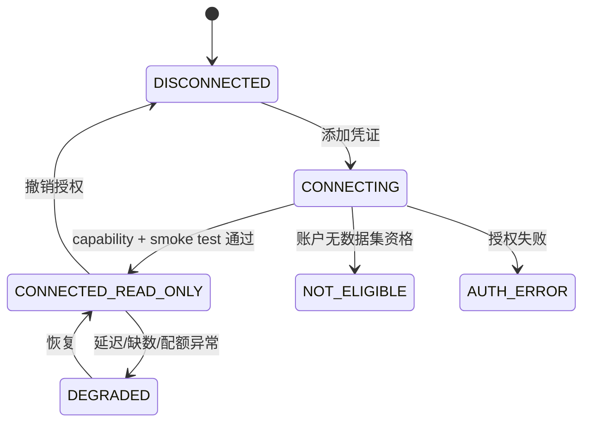
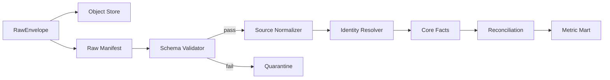

# API 与 MCP 适配器设计

## 1. 适配器目标

连接层将来源差异隔离在领域模型之外。真实、沙箱、文件和合成适配器实现相同契约；应用页面只消费标准 DTO。缺少密钥时返回明确连接状态，不用随机 fallback 冒充真实响应。

## 2. 通用读取契约

```python
from dataclasses import dataclass
from datetime import datetime
from typing import AsyncIterator, Literal, Protocol

@dataclass(frozen=True)
class Capability:
    dataset: str
    grains: tuple[str, ...]
    earliest_available_at: datetime | None
    freshness_sla_seconds: int | None
    attribution_models: tuple[str, ...]
    write_supported: bool

@dataclass(frozen=True)
class PullRequest:
    tenant_id: str
    connection_id: str
    marketplace: str
    dataset: str
    window_start: datetime
    window_end: datetime
    cursor: str | None
    idempotency_key: str

@dataclass(frozen=True)
class RawEnvelope:
    source: str
    source_kind: str
    semantic_source_kind: str
    transport: Literal["REST", "REPORT", "MCP", "UPLOAD", "SYNTHETIC"]
    collected_at: datetime
    marketplace: str
    timezone: str
    currency: str
    grain: str
    attribution_window: str
    is_estimated: bool
    confidence: float
    synthetic: bool
    schema_version: str
    payload: bytes
    content_type: str
    source_cursor: str | None

class ReadAdapter(Protocol):
    async def health(self) -> dict: ...
    async def capabilities(self) -> list[Capability]: ...
    async def pull(self, request: PullRequest) -> AsyncIterator[RawEnvelope]: ...
```

约束：

- `RawEnvelope` 的来源元数据不可由下游猜测；非货币记录使用 `currency=XXX`，非归因记录使用 `attribution_window=NONE`。
- `pull` 只返回 raw，不直接写 core 表。
- 标准化器按 `source + dataset + schema_version` 注册。
- 每页/每个报表保存 source cursor 和 checksum，支持断点续拉。
- 适配器抛出规范错误：`AUTH`、`NOT_ELIGIBLE`、`RATE_LIMITED`、`SCHEMA_CHANGED`、`SOURCE_DELAYED`、`QUOTA_EXHAUSTED`、`INVALID_WINDOW`。

## 3. 连接生命周期



`SIMULATED` 是独立状态，永远不升级为 `CONNECTED_READ_ONLY`。切换真实连接需要用户显式选择并通过 smoke test。

## 4. 来源适配器

### 4.1 SP-API Adapter

子模块：`reports`、`data_kiosk`、`listings`、`catalog`、`inventory`、`pricing`、`fees`、`finances`、`inbound`。

- LWA token 只在服务端内存短暂存在，refresh token 从 Secrets Manager 读取。
- Reports/Data Kiosk 使用 submit/poll/download 状态机。
- 下载文档先保存在对象存储，再校验压缩、编码和 schema。
- capability discovery 检查角色、marketplace、数据集版本和可用窗口。
- 不调用 Restricted Data Token，不请求 buyer info/address。
- Listing 读取与未来 Listing 写入分为不同适配器和服务身份。

### 4.2 Amazon Ads Adapter

接口拆分：

```text
AdsEntityReader
AdsLegacyV3ReportReader
AdsUnifiedReportReader
AdsMarketingStreamConsumer (future)
AdsMutationPreviewer (future, disabled)
AdsMutationExecutor (future, not deployed in MVP)
```

Ads 标准 DTO 禁止丢失：`reporting_system`、`ad_product`、`profile_type`、`metric_namespace`、`attribution_model`、`lookback_days`、`conversion_maturity`。旧报表和统一报表各自 normalizer，通过 reconcile 测试后才能在同一趋势中展示。

### 4.3 SellerSprite Adapter

- REST 为批量定时采集主路径，MCP 为受控探索路径。
- 原始返回字段映射到第三方估算模型，默认 `is_estimated=true`。
- 对所有 MCP 调用保存 tool name、arguments hash、response hash、时间和 token/配额信息。
- API/MCP 返回差异不自动取平均，保存两个 observation 并触发 source discrepancy。

### 4.4 Keepa Adapter

- 调度器维护 token budget，按自有 ASIN、核心竞品、长尾竞品分优先级。
- Keepa 时间编码在 normalizer 内转换并保留原始值。
- price、offer、rank 分别建观察记录，缺失不做前向填充超过配置 TTL。
- 对 best seller 类目识别限制保留 source warning。

### 4.5 PublicSource Adapter

- 优先官方 API；仅在条款允许时读取公共页面。
- 保存 URL、公开时间、采集时间、地区/语言和许可/用途标签。
- 不下载或再分发无授权视频素材。
- 页面 schema 变化时停止解析并隔离，不用 LLM 猜字段。

### 4.6 DocumentUpload Adapter

流程：预签名上传 -> 文件类型/大小校验 -> 病毒扫描 -> checksum -> 加密对象存储 -> 文档分类 -> OCR/结构化提取 -> 用户逐字段确认 -> 成本版本。

任何自动提取都不会直接修改成本事实。原始文件不可覆盖；替换文件形成新版本并链接 `supersedes_document_id`。

### 4.7 SyntheticAdapter

- 使用确定 seed、逻辑时钟和 scenario manifest 生成可重现数据。
- 响应形状模拟来源契约，但 source 固定为 `synthetic:<source>`。
- 故意注入迟到数据、配额失败、缺数和 schema 错误，以测试系统韧性。
- 不能读取真实凭证，也不能访问外部 API。

## 5. 标准化管道



Identity Resolver 使用显式映射：seller SKU <-> ASIN、Ads advertised SKU/ASIN、parent-child、source keyword ID。模糊匹配只能创建候选映射，必须人工确认。

## 6. 前端业务 API

所有 endpoint 使用 `/api/v1`，返回 `data_status` 和 `provenance_summary`。列表使用 cursor pagination；时间序列限定最大范围。

### 6.1 首页与洞察

| Method | Path | 用途 |
|---|---|---|
| GET | `/home/daily-brief?business_date=` | 今日判断、原因、行动、数据健康 |
| GET | `/home/hourly-alerts` | 重大异常和恢复事件 |
| GET | `/insights/{id}` | 异常/原因完整证据链 |
| POST | `/insights/{id}/feedback` | 相关、不相关、已处理、延后 |
| GET | `/metrics/{metric_key}/series` | 版本化指标趋势与 provenance |
| GET | `/metrics/observations/{id}/lineage` | 输入记录、计算版本和 SQL 引用 |

### 6.2 领域页面

| Method | Path | 用途 |
|---|---|---|
| GET | `/asins` | ASIN 列表、阶段和健康摘要 |
| GET | `/asins/{asin_id}/cockpit` | ASIN 驾驶舱 |
| GET | `/ads/search-terms` | 搜索词分析和筛选 |
| GET | `/ads/entities/{entity_id}` | 广告实体详情 |
| GET | `/keywords` | 关键词池、排名、份额 |
| GET | `/market/competitors` | 竞品观察 |
| GET | `/listings/{asin_id}/versions` | Listing 版本与差异 |
| GET | `/inventory/projection` | 库存覆盖和断货预测 |
| GET | `/finance/contribution-margin` | 利润及成本完整度 |

### 6.3 建议、审批与实验

| Method | Path | 行为 |
|---|---|---|
| POST | `/recommendations/{id}/draft-approval` | 从建议创建草案 |
| PATCH | `/approval-drafts/{id}` | 编辑目标值、原因、风险和观察窗 |
| POST | `/approval-drafts/{id}/submit` | 冻结输入并进入审核 |
| POST | `/approval-drafts/{id}/approve` | 状态变为 `APPROVED_NOT_EXECUTED` |
| POST | `/approval-drafts/{id}/reject` | 驳回并记录原因 |
| POST | `/approval-drafts/{id}/record-manual-execution` | 用户记录外部人工执行 |
| GET | `/experiments/{id}/review` | 前后窗口和成功标准 |

不存在 `/execute`、`/ads/mutate`、`/listings/patch` 或 `/price/update` endpoint。OpenAPI 测试必须证明这些路由未注册。

## 7. API 响应元数据

```json
{
  "data": {},
  "meta": {
    "request_id": "uuid",
    "generated_at": "2026-08-31T02:00:00Z",
    "business_timezone": "America/Los_Angeles",
    "data_status": "SYNTHETIC|PROVISIONAL|MATURED|INCOMPLETE",
    "synthetic": true,
    "freshness": {"oldest_collected_at": "...", "newest_collected_at": "..."},
    "provenance_summary": [
      {"source": "synthetic:amazon_ads", "source_kind": "SYNTHETIC", "semantic_source_kind": "FIRST_PARTY", "is_estimated": false}
    ],
    "metric_definition_versions": ["acos@1.0.0"]
  }
}
```

当查询会混合 `synthetic=true` 与 `synthetic=false` 时，MVP 返回 `MIXED_DATA_BLOCKED` 错误，不生成一个容易误读的混合响应。

## 8. 内部 MCP 设计

内部 MCP 是供 LLM 使用的只读/草案工具层，不直接暴露数据库和外部密钥。

| Tool | 输入 | 输出 | 副作用 |
|---|---|---|---|
| `get_daily_brief_inputs` | date, scope | 已计算指标与数据健康 | 无 |
| `get_metric_series` | metric_key, entity, window, basis | 版本化时间序列 | 无 |
| `get_asin_health` | asin_id, date | 销售/流量/广告/库存/排名摘要 | 无 |
| `get_insight_evidence` | insight_id | 证据、反证、lineage | 无 |
| `compare_periods` | entity, metric_keys, windows | 同口径比较 | 无 |
| `simulate_policy_change` | draft inputs | 非承诺性情景区间 | 记录模拟运行 |
| `create_approval_draft` | recommendation_id, overrides | 草案 ID | 创建草案，不审批、不执行 |

工具返回 JSON Schema，强制 tenant scope、最大时间范围和 metric allowlist。MCP 服务身份只拥有 `analytics_read` 与 `approval_draft_create`。

禁止工具：任意 SQL、任意 URL fetch、密钥读取、广告写入、Listing 写入、价格写入、审批通过。

## 9. 建议与草案契约

建议对象必须包含：

```json
{
  "recommendation_type": "AD_BID_CHANGE_DRAFT",
  "target": {"kind": "TARGET", "id": "uuid"},
  "current_state": {"bid": 1.25, "currency": "USD"},
  "proposed_state": {"bid": 1.10, "currency": "USD"},
  "evidence_metric_ids": ["uuid"],
  "expected_outcome": {
    "metric": "spend",
    "direction": "DOWN",
    "range": null,
    "is_estimated": true
  },
  "risks": ["Impressions may decline"],
  "rollback_plan": "Restore previous bid manually",
  "review_after": "P7D",
  "requires_approval": true,
  "execution_capability": "NOT_AVAILABLE_IN_MVP"
}
```

没有可靠模型时 `expected_outcome.range` 必须为 null，不能凭空填写收益数字。

## 10. 幂等、并发与冲突

- 所有 POST 使用 `Idempotency-Key`。
- 草案保存输入数据版本；输入改变后草案标记 `STALE`。
- 同一目标同一字段只能有一个 `READY_FOR_REVIEW` 草案，其他标记冲突。
- 审批操作采用 optimistic locking (`version`/ETag)。
- 人工执行记录不能声称 API 已成功，`execution_method=MANUAL_RECORDED`。
- 所有 API 写业务事件均追加到 audit log，不用 update 覆盖历史。

## 11. 适配器契约测试

每个适配器必须通过同一测试套件：

- capability 与实际可拉数据集一致。
- 每条 envelope 具有完整 provenance。
- pagination/异步报告可恢复且无重复。
- 限流与 retry 不丢失 idempotency。
- schema 变化进入 quarantine。
- 真实适配器永不产生 `synthetic=true`，合成适配器永远产生 `synthetic=true`。
- 缺少密钥返回 `DISCONNECTED`，不自动返回合成数据。
- write capability 在 MVP 始终 false。
