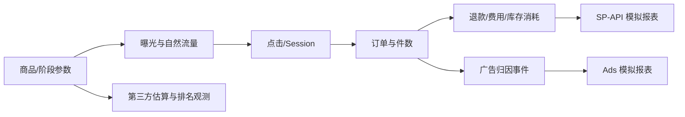

# 模拟数据规范

## 1. 目标

在没有真实 API 和店铺数据时，生成足够大、业务一致、可重现的数据集，用于开发完整运营闭环、异常场景、性能测试和演示。合成数据不是对用户店铺的预测，也不声称代表某个真实类目。

## 2. 不可违反的标识

- 所有合成记录 `synthetic=true`。
- source 使用 `synthetic:<intended_source>`，例如 `synthetic:amazon_sp_api`。
- `source_kind=SYNTHETIC`，并用 `semantic_source_kind` 标识模拟的是 FIRST_PARTY、THIRD_PARTY_ESTIMATE、PUBLIC_OBSERVATION、USER_PROVIDED 或 AI_INFERENCE；模拟第三方估算/AI 推断同时 `is_estimated=true`。
- 所有 API 响应顶层返回 `data_status=SYNTHETIC`。
- Web 全局固定显示“模拟数据：未连接真实 Amazon API”。
- 导出文件名、页眉和数据 sheet 包含 `SYNTHETIC`。
- 合成 ID 使用显式前缀，如 `SYN-ASIN-001`、`syn-campaign-001`，避免暗示真实 ASIN。
- 禁止从公开真实 ASIN 复制销售、成本或广告数据后称为合成。

## 3. 可重现性

每套数据由 scenario manifest 决定：

```yaml
scenario_id: us_demo_v1
generator_version: 1.0.0
seed: 20260831
logical_today: 2026-08-31
marketplace: US
business_timezone: America/Los_Angeles
currency: USD
asin_count: 20
history_days: 365
synthetic: true
```

相同 manifest 与代码版本必须产生相同 raw payload checksum 和 golden metrics。推进逻辑时间创建新 scenario run，不使用系统当前时间隐式改变历史。

## 4. 数据规模档位

| Profile | 用途 | 规模 |
|---|---|---|
| `tiny` | 单元/集成测试 | 2 ASIN、14 天、少于 5k rows |
| `demo` | 产品演示 | 20 ASIN、365 天、约 0.8-1.5M core observations |
| `load` | 性能 | 20 ASIN、730 天、更高关键词/搜索词密度，约 3-5M rows |
| `failure_lab` | 韧性/安全 | 缺页、重复、迟到、schema drift、恶意文档 fixture |

Demo 建议组成：

- 20 ASIN、20-35 SKU、4 个经营阶段各至少 4 个 ASIN。
- 365 天 ASIN/store 零售日事实。
- 90 天日内小时流量/库存快照。
- 50-80 Campaign、150-250 Ad Group、800-1,500 Target。
- 2,000-4,000 Search Term，180 天广告日事实。
- 运营域 250-400 个重点关键词，180 天每天 2-4 次排名快照。
- 80-120 竞品 ASIN，价格/评分/BSR 快照。
- 至少 30 个细分市场和 3,000 个候选/竞品 ASIN 快照。
- 至少 20,000 个选品关键词、10,000 条评论主题/用户痛点记录、500 个短视频或广告创意信号。
- 至少 100 个候选产品、20 套供应商报价、30 个产品成本情景。
- 采购/物流/成本文档 20-40 份合成 fixture，覆盖合同、定金/尾款、运输、批次和费用分摊。

具体行数由生成器报告，不在 UI 写死。

### 4.1 选品演示覆盖

- 睡眠、枕头和家居用品作为深度案例，提供从细分市场、痛点、差异化、供应商报价到成本情景的完整证据链。
- 另建跨类目候选池，覆盖不同价格带、竞争程度、合规/知识产权风险、退货风险和季节性，用于新店选品演示。
- 100 个候选产品分布到完整状态机；至少 20 个进入深度验证，至少 10 个进入供应商/打样阶段，至少 15 个因不同原因淘汰并保存证据。
- 12 个评分维度由固定 seed、版本化归一化规则和权重程序计算；生成器输出原始指标、标准化分数、权重、扣分理由和待人工核实事项，LLM 不参与数值生成。
- 公开真实产品资料只能保存为 `source_kind=PUBLIC_WEB, semantic_source_kind=PUBLIC_OBSERVATION`。订单、销量、广告、利润、供应商报价和成本等演示值必须来自合成世界并保持 `synthetic=true`，不得描述为真实公开数据。

## 5. 生成模型

### 5.1 商品画像

每个 ASIN 随机但受约束地获得：

- 阶段、价格带、基础 Sessions、基础 CVR、评分、评论量、利润结构。
- 品牌/父子体/产品类型采用虚构名称。
- 目标关键词和竞争集合。
- 季节性、星期效应和促销敏感度。
- 库存起点、补货周期、供应不确定性。

参数保存在 manifest 扩展中，便于解释生成原因。

### 5.2 事件优先生成

为保证跨表一致，先生成潜在经营事件，再投影为各来源报表：



不分别随机生成 Sales、Orders、Spend、Ad Sales 后强行拼表。

### 5.3 基本约束

- `clicks <= impressions`。
- `ad purchases <= clicks`（按定义允许 fractional attribution 时使用 numeric）。
- `spend` 由 clicks 与 CPC 生成，并允许小数舍入误差。
- `units >= order_items` 在多件购买场景中成立。
- 库存消耗与发货/订单存在合理时间关系，库存不可无解释变负。
- Coupon/价格/Listing 事件在正确时间进入快照。
- 广告归因按窗口回补，转化日与 traffic date 可不同。
- Ad Sales 某天可能高于该天 Retail Sales，因为日期基础、brand halo 和归因不同；不设置错误的逐日上限。
- Store source total 可包含未纳入 20 ASIN 的边缘 SKU，禁止只把 ASIN 行求和冒充 source total；manifest 可配置是否存在该差额。

### 5.4 第三方估算

SellerSprite/Keepa 模拟值从潜在事件加偏差、滞后和噪声生成，并记录估算误差机制：

- 月销量估算采用有偏区间，不与官方 units 完全相等。
- 搜索量为 query demand 的估算，有月度粒度和修订。
- 排名存在设备/地区扰动和未找到情况。
- Keepa 价格观测可有采样缺口，不用永久前向填充。

### 5.5 阶段建议生成

每天用上架天数、7/14/30 天销量、自然排名、广告销售占比、TACOS、贡献利润、流量/CVR 趋势和库存状态计算 `recommended_stage`、`stage_confidence` 与 `stage_reasons`。`effective_stage` 通过用户确认 fixture 产生；至少包含建议被接受、被修改、被锁定和人工覆盖四类历史，系统生成器不得把推荐阶段直接写成已生效策略。

### 5.6 采购与成本链路

先生成供应商、MOQ、阶梯报价、样品单和采购单，再生成定金/尾款、物流、到货批次及头程/关税/包装分摊。OCR fixture 字段先为 `UNCONFIRMED`；只有确认事件之后才创建 COMPLETE 成本版本，未确认场景只输出成本区间。

## 6. 必备业务场景

| Scenario code | 场景 | 预期系统行为 |
|---|---|---|
| `NO_ORDER_LOW_TRAFFIC` | 流量显著下降导致无单 | 指向流量，保留转化样本不足说明 |
| `NO_ORDER_STOCKOUT` | fulfillable 归零 | 库存为首因，阻止加预算建议 |
| `LISTING_SUPPRESSED` | Listing 不可售 | Critical 告警和修复草案，不归因给广告 |
| `BUDGET_EXHAUSTED` | 高效 Campaign 中午耗尽 | 放量阶段预算草案；显示库存 guardrail |
| `HIGH_CLICK_LOW_CVR` | 搜索词高点击无购买 | 否词/Listing/价格候选，非确定因果 |
| `RANK_DROP_RECOVERY` | 核心词自然排名连续下滑 | 排名恢复阶段提高防守建议 |
| `PRICE_RISE_CVR_DROP` | 涨价后 CVR 下降 | 标 observed association，建议实验/观察 |
| `COMPETITOR_COUPON` | 竞品新增优惠 | 市场证据出现，但不宣称直接导致订单下降 |
| `REFUND_SPIKE` | 退货/退款上升 | 贡献利润和评价主题告警 |
| `INBOUND_DELAY` | 入库 ETA 延迟 | projected stockout 提前，补货/广告 guardrail |
| `ATTRIBUTION_LATE` | Ads 销售分多日回补 | ACOS provisional -> matured，历史版本保留 |
| `SOURCE_OUTAGE` | SP/Ads 某窗口缺数 | 数据质量告警，抑制结论 |
| `SCHEMA_DRIFT` | 来源新增/改变字段 | quarantine，不静默解析 |
| `DUPLICATE_PAGE` | 相同 cursor 页重复 | 幂等去重，raw run 事件保留 |
| `COST_INCOMPLETE` | 头程/采购成本未确认 | 利润显示区间/不可用，不输出精确 break-even ACOS |

## 7. 四阶段样本设计

### 7.1 新品冷启动

- 数据历史短、自然排名低、广告占比高、转化波动大。
- 有少量高 ACOS 但排名改善的合理案例，也有无效扩词反例。
- 避免生成“高 ACOS 一定错误”的单一模式。

### 7.2 稳定放量

- 订单稳定、预算受限机会、库存约束和边际流量下降并存。
- 增预算建议必须经过库存天数和 break-even guardrail。

### 7.3 利润收割

- 自然流量占比高、部分长尾广告浪费、成本变动影响利润。
- 模拟缩减低效流量后利润改善但订单略降的权衡。

### 7.4 排名恢复

- 历史排名下降、阶段性高 ACOS、核心词防守与 CVR 修复。
- 至少一个反例：排名掉失实际由库存/不可售导致，系统应先修供给。

## 8. 广告归因模拟

- 默认 Seller Sponsored Products click lookback 使用 manifest 配置，例如 7 天；不得由页面硬编码。
- 生成 click cohort 与后续 purchase event，再按 attribution model 归属 traffic date。
- 每日初次报表只包含已发生转化，随后回补到成熟。
- 生成 legacy 与 unified reporting 的独立样例时，给不同 metric namespace；只对明确等价字段做 reconcile。
- Search term、target、campaign 聚合必须从同一底层事件得到，允许来源报表的合法差异但需记录原因。

## 9. 文档 fixture

合成采购/物流文档使用虚构公司、账户、签名和编号，并在每页加 `SYNTHETIC TEST DOCUMENT`。包括：

- 正常多币种采购单。
- 同 SKU 不同成本生效期。
- 缺少头程费用的部分成本。
- OCR 模糊数字、重复发票、币种冲突。
- 含诱导文本的 prompt injection 安全 fixture。
- 超大/错误 MIME/恶意压缩测试文件仅用于安全测试，不进入演示下载。

## 10. 数据质量注入

错误必须在 manifest 显式声明，不使用不可重现的随机失败：

```yaml
faults:
  - code: ads_late_attribution
    entity: syn-campaign-014
    starts_at: 2026-08-25T00:00:00Z
    release_schedule: [P1D, P3D, P7D]
  - code: inventory_missing_snapshot
    sku: SYN-SKU-007
    window: [2026-08-29T08:00:00Z, 2026-08-29T12:00:00Z]
```

系统应能区分业务异常与数据异常。

## 11. 置信度与标签

合成 first-party 字段在合成世界内可以 `source_kind=SYNTHETIC, semantic_source_kind=FIRST_PARTY, confidence=1.0, is_estimated=false`，但 synthetic 始终为 true。模拟估算和 AI 推断使用校准规则：

- 第三方估算保存估算区间和方法版本。
- OCR 字段保存字段级 confidence，未确认不进入完整成本。
- AI 原因 confidence 由证据引擎输入，不能因为是合成真相就给 1.0；模型只能看到系统实际可见证据。

## 12. 泄漏与混合防护

- 合成与真实连接不能在同一 tenant/environment 同时启用；未来混合研究模式需单独设计。
- 数据库 constraint 校验 source registry 与 synthetic 标志。
- API 若检测混合结果返回 `MIXED_DATA_BLOCKED`。
- 生产导入合成数据需要显式 `ALLOW_SYNTHETIC_SEED=true`，默认 false。
- 清理命令必须按 tenant + scenario_id + synthetic=true 三重范围，执行前展示计数；不使用宽泛删除。

## 13. 验收

- 相同 manifest 生成 checksum 稳定。
- 所有记录 provenance 完整，synthetic 漏标为 0。
- 跨事实约束和聚合 reconcile 通过。
- 每个必备场景有预期 alert/insight/recommendation golden result。
- 隐藏 generator truth 后，诊断仅使用可见数据，不偷读场景标签。
- UI、API、导出和文档均能明显识别模拟数据。
- 任何外部网络/API 调用计数为 0。
