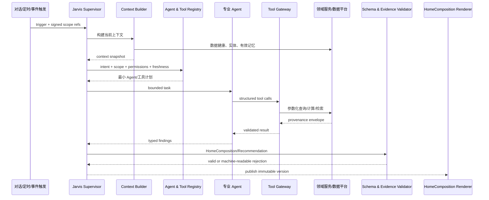

# AI 编排与动态工作空间设计

- 文档版本：`0.2`
- 状态：`设计基线；Store Operations M1 纵切片已实现，其余能力仍为设计`
- 范围：Jarvis Supervisor、专业 Agent、工具层、主动分析、HomeComposition、长期记忆与安全边界
- MVP 数据状态：合成数据；所有输出必须显示 `synthetic=true`

## 1. 设计目标

AI 是系统入口和控制平面，但不是事实数据库、指标计算器或权限根。Jarvis Supervisor 负责理解意图、识别上下文、选择专业 Agent 与最小工具集、综合证据、排序行动、编排页面和创建审批草案。SQL、版本化分析程序和领域服务负责精确计算；前端组件注册表负责可控呈现；审批服务负责状态与权限。

核心不变量：

1. 没有工具证据的经营数值不能作为事实发布。
2. 所有结论携带来源、时间范围、数据新鲜度、估算属性、置信度、限制和原始记录引用。
3. 不兼容的归因窗口、日期口径、币种或粒度由工具层拒绝，Supervisor 不能绕过。
4. 动态首页只组合注册组件，不生成任意 UI 代码。
5. 记忆用于补充业务背景，不能替代当前数据查询。
6. MVP 不存在 Amazon 或其他外部系统写执行能力。

## 2. 运行拓扑



一次业务请求对应一个 `ai_run`；Supervisor 调用每个专业角色形成 `agent_run`；工具调用、输出和模型用量分别追加记录。任何重试产生新的 attempt，不覆盖原记录。

## 3. 上下文契约

上下文构建器接收前端选择和系统触发，但所有 tenant、权限、对象归属都由服务端重新确认。

```json
{
  "tenant_id": "uuid",
  "user_id": "uuid",
  "marketplace": "ATVPDKIKX0DER",
  "business_timezone": "America/Los_Angeles",
  "display_timezone": "Asia/Shanghai",
  "business_date": "2026-08-30",
  "scope": {
    "store_id": "uuid",
    "asin_ids": ["uuid"],
    "campaign_ids": [],
    "keyword_ids": [],
    "candidate_product_ids": []
  },
  "period": {"start": "date-time", "end": "date-time", "comparison": "PREVIOUS_PERIOD"},
  "filters": {},
  "stage_context": [{
    "asin_id": "uuid",
    "recommended_stage": "LAUNCH",
    "effective_stage": "LAUNCH",
    "stage_confidence": 0.84,
    "manual_override": false,
    "locked_by_user": false
  }],
  "source_preferences": ["AMAZON_OFFICIAL", "FIRST_PARTY", "THIRD_PARTY"],
  "ui_origin": {"page": "ASIN_COCKPIT", "component_id": "acos-90d", "row_id": null},
  "data_status": "READY|PROVISIONAL|STALE|INCOMPLETE|SYNTHETIC"
}
```

“问 AI”必须携带 UI origin、对象引用、筛选器、时间范围、来源摘要和指标 observation ID。上下文快照仅说明用户当时看到了什么；Agent 仍通过工具读取最新授权数据，并在两者不一致时提示页面已更新。

## 4. Jarvis Supervisor

### 4.1 职责

- 识别用户显式意图与主动触发目标。
- 判断当前经营状态及必须优先处理的数据质量问题。
- 分解任务、选择专业 Agent、决定串并行依赖和调用预算。
- 根据权限、连接、数据新鲜度和风险动态加载工具。
- 合并一致结论，保留冲突观点和替代假设，不伪造共识。
- 按影响、紧迫性、置信度、可逆性、阶段权重和风险排序。
- 生成 HomeComposition、Recommendation、ApprovalRequest 或追问。
- 跟踪建议、人工操作和实验的后续观察结果。

### 4.2 禁止事项

- 不直接执行 SQL，不读取数据库连接，不访问任意 URL。
- 不在上下文中心算 Sales、ACOS、TACOS、利润、库存天数等核心指标。
- 不把推断变成第一方事实，不用记忆填补最新数据缺口。
- 不绕过审批服务改变状态，不将“批准”解释为“已执行”。
- 不生成组件注册表之外的 UI 或可执行代码。

### 4.3 运行计划

Supervisor 首先执行轻量预检：权限、数据健康、已有异常、触发类型和用户上下文。随后生成只供系统使用的结构化计划，包含 agent、依赖、工具包、最大调用数、时限和停止条件。计划本身不是经营结论；用户可查看的是运行状态、所用 Agent/工具、证据和限制，不暴露隐藏推理文本。

## 5. 专业 Agent 契约

| Agent | 输入范围 | 首选工具包 | 输出 |
|---|---|---|---|
| 店铺经营 | 店铺、业务日、阶段组合 | store、funnel、compare、anomaly | 全店判断、原因树、行动候选 |
| 广告与搜索词 | profile/campaign/ad group/target/search term | ads、search terms、compare、anomaly | 浪费、机会、预算/竞价草案 |
| Listing 与转化 | ASIN、Listing version、CVR、价格 | ASIN、funnel、reviews、competitor | 转化阻断、内容假设、Listing 草案 |
| 关键词与自然排名 | ASIN-keyword、采集 context | ranking、search shares、ads | 收录/排名变化、词机会、恢复建议 |
| 竞品 | 已确认竞品集合 | competitor、price、review topics | 竞品变化、关联观察、响应建议 |
| 选品 | 市场、约束、候选池 | opportunities、candidate evaluation、news | 候选排序、证据、风险、验证计划 |
| 库存与补货 | SKU、库存、inbound、velocity | inventory risk、forecast、documents | 断货区间、补货参数与采购草案 |
| 财务与利润 | ASIN/SKU、成本版本、价格 | margin、price simulation、FX | 成本完整度、利润区间、guardrail |
| 评价与用户痛点 | ASIN、评价/反馈/退货主题 | review topics、documents | 主题、频次、证据片段、产品问题 |
| 市场趋势与政策 | marketplace、类目、政策域 | policy search、news search、impact | 变化、有效期、受影响对象、风险/机会 |
| 创意与短视频 | ASIN、受众、合规公开信号 | public trend search、reviews、experiments | 创意方向、证据、测试草案 |
| 风险与合规 | 建议、草案、政策、数据状态 | policy、lineage、approval checks | 风险等级、阻断项、待确认事项 |

每个 Agent 输出统一 finding envelope：`finding_type`、`claim`、`evidence_refs`、`data_period`、`confidence`、`causal_status`、`limitations`、`alternative_hypotheses`、`recommended_next_step`。未使用工具或没有有效 evidence reference 的 finding 只能标为待验证假设，不能进入首页“已确认原因”。

## 6. 工具注册与动态加载

### 6.1 MVP 工具目录

- 经营：`get_store_summary`、`get_asin_performance`、`get_order_funnel`、`compare_periods`。
- 广告与关键词：`get_ad_performance`、`get_search_terms`、`get_keyword_ranking`。
- 诊断：`detect_anomalies`、`explain_metric_change`。
- 库存与利润：`get_inventory_risk`、`calculate_contribution_margin`、`simulate_price_and_profit`。
- 市场与产品：`get_competitor_changes`、`get_review_topics`、`find_product_opportunities`、`evaluate_product_candidate`。
- 政策与新闻：`search_amazon_policy`、`analyze_policy_impact`、`search_market_news`。
- 工作流：`get_experiment_results`、`create_recommendation`、`request_user_approval`。

`execute_approved_action` 是未来版本契约，不属于 MVP 工具目录。MVP 代码、Tool Registry、MCP manifest、OpenAPI、worker、服务凭证和部署清单均不得出现可调用实现。

### 6.2 注册元数据

每个工具版本记录：名称、用途、输入/输出 JSON Schema、risk class、允许的 Agent、所需 RBAC permission、支持 source、data freshness 要求、timeout、rate limit、cost class、是否只读、是否允许 synthetic、owner 和停用状态。

动态选择规则：

1. 先以 intent 选择工具包，再按实体 scope 缩小。
2. 移除用户无权限、连接不可用、来源过期或当前模式禁止的工具。
3. 对低风险独立读取可并行；对存在依赖的计算和影响分析串行。
4. 每次运行设置工具调用数、模型 token、时间和成本上限。
5. 新工具默认不可见，必须完成 Schema、权限、提示注入和审计测试后启用。

### 6.3 统一工具结果

```json
{
  "status": "OK|PARTIAL|NO_DATA|STALE|ERROR",
  "data": {},
  "source": [{
    "name": "string",
    "source_kind": "SYNTHETIC",
    "semantic_source_kind": "FIRST_PARTY"
  }],
  "collected_at": "date-time",
  "data_period": {"start": "date-time", "end": "date-time"},
  "marketplace": "string",
  "timezone": "string",
  "currency": "USD",
  "grain": "string",
  "date_basis": "ORDER_DATE|TRAFFIC_DATE|SNAPSHOT_TIME|DOCUMENT_DATE|OTHER",
  "attribution_window": "string",
  "is_estimated": false,
  "synthetic": true,
  "confidence": 0.0,
  "limitations": ["string"],
  "raw_record_reference": ["opaque-id"],
  "metric_observation_ids": ["uuid"],
  "schema_version": "string"
}
```

所有字段都由工具网关补齐并校验。`source_kind` 表达实际采集通道，`semantic_source_kind` 表达数据语义；无适用币种或归因窗口时分别使用 `XXX` 和 `NONE`，不用含义不明的空值。

## 7. HomeComposition

### 7.1 顶层 Schema

```json
{
  "schema_version": "1.0",
  "composition_id": "uuid",
  "business_date": "date",
  "generated_at": "date-time",
  "marketplace": "ATVPDKIKX0DER",
  "home_state": "NORMAL|ORDER_AD_ANOMALY|INVENTORY_PROFIT_RISK|MARKET_POLICY_CHANGE|DATA_INCOMPLETE",
  "objective_profile": "LAUNCH_GROWTH|SCALE_GROWTH|HARVEST_PROFIT|RECOVERY_RANK|MIXED_STORE",
  "overall_judgment": "string",
  "overall_confidence": 0.0,
  "requires_approval": true,
  "judgment_reasons": [{"claim": "string", "evidence_refs": ["opaque-id"]}],
  "top_issue": {"summary": "string", "severity": "INFO|WARNING|CRITICAL", "evidence_refs": []},
  "best_signal": {"summary": "string", "evidence_refs": []},
  "top_actions": [{"recommendation_id": "uuid", "priority": 1, "requires_approval": true}],
  "data_status": {"status": "SYNTHETIC", "updated_at": "date-time", "source_refs": []},
  "blocks": [{
    "block_id": "uuid",
    "component_type": "order_funnel",
    "component_version": "1.0",
    "priority": 1,
    "display_reason": "string",
    "title": "string",
    "data_ref": "opaque-query-result-id",
    "evidence_refs": ["opaque-id"],
    "data_period": {"start": "date-time", "end": "date-time"},
    "updated_at": "date-time",
    "confidence": 0.0,
    "limitations": [],
    "requires_approval": false
  }]
}
```

`data_ref` 指向服务端已授权、可复取的结构化 DTO，不把任意查询或完整数据集塞入组合。前端按 component type/version 查找渲染器；未知类型、越权引用或 Schema 失败显示安全错误块并上报，不执行降级字符串。

### 7.2 组合规则

- 首屏始终保留店铺/站点/日期、同步状态、AI 问候/结论、输入框、前三行动、重大问题、最佳信号和审批摘要的稳定信息层级。
- 动态变化的是 block 类型、顺序、密度和展开状态，不改变全局导航和基本交互位置。
- Critical 风险优先于机会；库存不可售会抑制“增加广告”类行动。
- `objective_profile` 由已确认的 `effective_stage` 及店铺阶段组合生成：LAUNCH 优先订单/曝光/点击/CVR/排名，SCALE 优先增长/边际 ACOS/TACOS/库存，HARVEST 优先贡献利润/现金效率/自然单，RECOVERY 优先目标词排名/订单/CVR/流量结构；利润对 LAUNCH 是止损约束而非唯一主目标。
- 每日阶段分析可写 `recommended_stage`、置信度和原因并创建确认提醒，但不能自行修改 `effective_stage`；用户修改或锁定时形成新的阶段历史版本。
- `DATA_INCOMPLETE` 优先展示缺失来源、受影响结论和补数动作，不生成确定性归因。
- 同一事实不以多个卡片重复争抢注意力；相关块由一个主块加证据抽屉表达。
- 所有结论可展开到 Agent、工具、指标、来源、采集时间和限制。

## 8. 主动分析

| 模式 | 触发 | 范围 | 发布结果 |
|---|---|---|---|
| 每日深度分析 | 美国站配置业务时间每日一次 | 订单、广告、搜索、排名、库存、利润、评价、竞品、选品、政策、实验 | 运营晨报 + 新 HomeComposition |
| 小时异常监控 | 每小时 | 订单、花费、CPC、CVR、预算、可售、Buy Box、库存、账号、竞品价格 | anomaly event；仅新发/升级/恢复通知 |
| 事件驱动 | 已注册业务事件 | 与事件相关的实体和 Agent | 定向 insight、任务/组合更新建议 |

触发器必须使用幂等键。事件消息是“可能已变化”的通知，不是事实；Agent 必须读取当前数据。日任务与小时任务重叠时，以 lineage 和计算版本去重，不用最后写入者静默覆盖。

## 9. 新闻与政策处理

1. 检索以 Amazon 官方公告、Seller Central、Amazon Ads、开发者公告和政府/监管官方来源为优先。
2. 保存 URL、发布/生效日期、采集时间、页面快照 hash、来源权威级别和变更版本。
3. 政策事实与第三方新闻解读分表；第三方只能补充语境。
4. 市场趋势与政策 Agent 提取变化，风险与合规 Agent 复核适用性和不确定性。
5. `analyze_policy_impact` 使用当前目录、Listing、广告、库存和业务配置识别受影响对象。
6. 政策影响输出机会/风险、严重度、受影响 ASIN、期限、建议、审批需求、置信度和限制。
7. 无法取得原始链接、发布日期或适用范围时不能发布为已确认政策卡。

## 10. 长期记忆

### 10.1 可保存内容

- 用户经营目标、风险偏好和展示偏好。
- ASIN 阶段及用户确认的阶段变化。
- 建议的批准、拒绝、延后与原因。
- 广告、Listing、价格、Coupon 的人工操作记录。
- 实验设计与结果、选品研究和淘汰原因。
- 供应商/成本历史及用户明确确认的产品事实。

### 10.2 写入与读取策略

- 用户明确陈述的业务事实可创建待确认记忆；影响计算的事实必须确认后才能进入核心数据或成本版本。
- AI 推断只能写 `AI_INFERENCE`，保存 evidence、置信度和到期时间。
- 临时假设必须有验证任务和短有效期。
- 用户纠正通过新记录 supersede 旧记录，保留历史审计。
- 检索按 tenant、实体、意图、时间有效性和来源质量过滤；默认只返回少量最相关记忆。
- 当前工具结果与记忆冲突时，以当前数据为准，并提出记忆复核，不自动改写。

## 11. 建议、审批与未来执行

AI 可自动查询、分析、生成图表、创建建议、实验草案、广告/Listing/补货/选品草案和审批请求。审批卡必须显示：修改对象、修改前后、原因、证据、预期方向/区间、最大风险、观察周期、冲突检查和回滚条件。

MVP 审批状态：

`DRAFT -> READY_FOR_REVIEW -> APPROVED_NOT_EXECUTED | REJECTED | SNOOZED | EXPIRED | STALE`

用户批准只证明意图，不代表 Amazon 已修改。用户可以另行记录 `MANUAL_RECORDED`，并附外部操作时间/引用。未来 `execute_approved_action` 若进入实现，必须是独立高风险服务，校验不可变 action hash、批准者、权限、版本、新鲜度、冲突、幂等、限流和回滚；这不属于 MVP。

## 12. 失败与安全回退

| 失败 | 系统行为 |
|---|---|
| 数据源断流或关键数据过期 | 标记 `DATA_INCOMPLETE`，抑制依赖结论和审批 |
| Agent 超时/预算耗尽 | 返回部分结果和缺失域，不伪造补全 |
| 工具 Schema 或来源信封无效 | 隔离输出，记录失败，不进入综合 |
| Agent 结论冲突 | 展示冲突与各自证据，必要时追问 |
| HomeComposition 校验失败 | 保留上一个可用版本并显式 stale，或显示安全空状态 |
| Prompt injection 内容 | 当作不可信数据；工具权限不因文本指令扩大 |
| 审批引用数据已变化 | 标记 `STALE`，要求刷新草案 |
| 未知组件版本 | 显示受控错误块并记录，不执行 payload |

## 13. 可观测性与成本

- trace 串联 request/trigger、ai run、agent run、tool call、tool output、metric、insight、composition、recommendation 和 approval。
- 记录模型、prompt version、token、缓存 token、成本、延迟、重试、tool error 和 validator result。
- 成本预算按触发类型配置：小时异常最小、页面问答中等、每日深度分析较高。
- 相同 scope、指标版本和问题可短期复用工具结果；任何 freshness 变化使缓存失效。
- 不在日志保存 secret、authorization、完整敏感文档或不必要买家 PII。

## 14. 实施切分

1. 定义 Context、ToolResult、Finding、Recommendation、ApprovalRequest 与 HomeComposition Schema。
2. 建立 Agent/Tool/Component Registry 和服务端校验器。
3. 实现对话、运行、工具、洞察、组合、记忆和政策表迁移。
4. 先实现店铺经营、广告搜索词、库存利润、市场政策和风险合规 Agent，覆盖首页七个验收场景。
5. 接入其余专业 Agent 与页面内“问 AI”。
6. 实现主动触发、失效传播、可观测性、成本预算和安全测试。

本文件仍是总体设计契约。已实现边界以 [M1 Jarvis Runtime Status](12-m1-runtime.md) 为准；当前没有连接任何真实 Amazon API。
